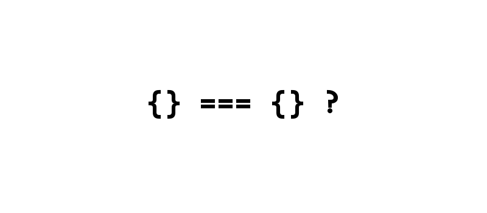

<div align="center">
  <br><br>
</div>

<div align="center">
  <br><br>
</div>

<center>

| **`Issues`** | **`Forks`** | **`Stars`** | **`License`** | **`Twitter`** | **`license scan`** |
|--------------|-------------|-------------|---------------|---------------|--------------------|
| [](https://github.com/tassianoalencar/repositorio-padrao/issues) | [](https://github.com/tassianoalencar/repositorio-padrao/network) | [](https://github.com/tassianoalencar/repositorio-padrao/stargazers) | [](https://github.com/tassianoalencar/repositorio-padrao) | [](https://twitter.com/intent/tweet?text=Wow:&url=https%3A%2F%2Fgithub.com%2Ftassianoalencar%2Frepositorio-padrao) | [](https://app.fossa.io/projects/git%2Bgithub.com%2Ftassianoalencar%2Frepositorio-padrao?ref=badge_shield) |

</center>


Descrição do projeto
Lorem Ipsum é simplesmente uma simulação de texto da indústria tipográfica e de impressos, e vem sendo utilizado desde o século XVI, quando um impressor desconhecido pegou uma bandeja de tipos e os embaralhou para fazer um livro de modelos de tipos. Lorem Ipsum sobreviveu não só a cinco séculos, como também ao salto para a editoração eletrônica, permanecendo essencialmente inalterado. Se popularizou na década de 60, quando a Letraset lançou decalques contendo passagens de Lorem Ipsum, e mais recentemente quando passou a ser integrado a softwares de editoração eletrônica como Aldus PageMaker. Porque nós o usamos? É um fato conhecido de todos que um leitor se distrairá com o conteúdo de texto legível de uma página quando estiver examinando sua diagramação. A vantagem de usar Lorem Ipsum é que ele tem uma distribuição normal de letras, ao contrário de "Conteúdo aqui, conteúdo aqui", fazendo com que ele tenha uma aparência similar a de um texto legível. Muitos softwares de publicação e editores de páginas na internet agora usam Lorem Ipsum como texto-modelo padrão, e uma rápida busca por 'lorem ipsum' mostra vários websites ainda em sua fase de construção. Várias versões novas surgiram ao longo dos anos, eventualmente por acidente, e às vezes de propósito (injetando humor, e coisas do gênero).


#### *Exibindo algum tipo de cógido*
```shell
$ php -v
```

```php
<?php
namespace Seu\NameSpace;

class NomeClasse extends Model implements ModelInterface
{

}
```

<div align="center">Made with <span style="color: #e25555;">&#9829;</span> in Switzerland</div>
